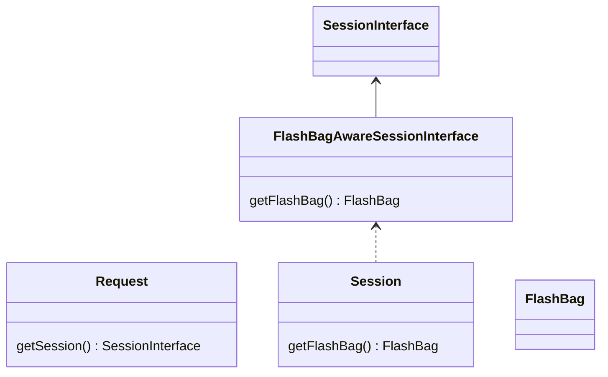

# PHPStorm Session reproducer

This package is a reproducer for a PHPStorm issue : [WI-71214](https://youtrack.jetbrains.com/issue/WI-71214/False-positive-Condition-is-always-false-because-session-is-evaluated-at-this-point)

The minimum classes were added in `src/` directory.
PHPStorm will trigger a false positive "Condition is always 'false' because '$session' is evaluated at this point" in `index.php:7`

## Class Diagram

